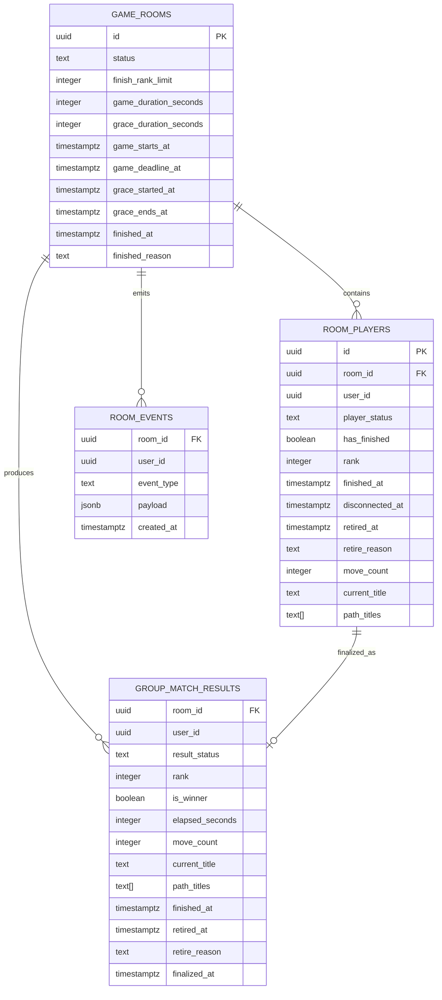

# Wiki Race 2.0 그룹 경기 DB·보안·라이프사이클 명세

> 문서 목적: 그룹 온라인 대전의 확정 규칙, 기존 보안 하드닝, 현재 DB 문제, 변경할 DB 구조와 RPC 책임을 한 문서에서 관리한다.  
> 적용 범위: 그룹 온라인 대전만 해당한다. 싱글, 게스트 싱글, 1:1 온라인 대전은 이번 변경 대상이 아니다.  
> 문서 상태: Phase 1 완료 / Phase 2A 완료 / Phase 2B 완료
> 운영 적용 상태: **미적용** — 현재까지의 마이그레이션과 검증은 로컬 Supabase에서만 수행했다.

---

# 1. 변경 배경

기존 그룹 경기 서버 규칙은 `finish_rank_limit = 3`을 경기 종료 기준으로 사용한다.

4인 테스트에서 확인된 기존 동작:

1. 1~3등이 정상 완주한다.
2. 3등 완주 직후 `game_rooms.status = finished`가 된다.
3. 4번째 참가자는 완주할 기회가 사라진다.
4. 4번째 참가자는 `room_players`에 미완주 상태로 남는다.
5. `group_match_results`에는 1~3등만 생성된다.
6. 미완주·퇴장·연결 끊김 결과가 최종 기록으로 보존되지 않는다.

따라서 다음 목표로 구조를 변경한다.

- 3등 이후에도 일정 시간 동안 4등 이후 완주 허용
- 전체 제한시간 제공
- 미완주자를 `RETIRE` 결과로 보존
- 참가자 행 삭제 대신 상태 전이 사용
- 완주자·RETIRE 참가자를 포함한 전체 결과 생성
- 서버 RPC를 통한 일관된 상태 확정
- 직접 테이블 조작을 단계적으로 차단

---

# 2. 확정된 그룹 경기 규칙

## 2.1 시간 규칙

- 전체 제한시간: **15분(900초)**
- 3등 완주 후 유예시간: **3분(180초)**
- 실제 종료 예정 시각은 다음 두 시각 중 빠른 값이다.
  - `game_starts_at + 15분`
  - `3등 완주 시각 + 3분`
- 3등이 나오지 않으면 시작 후 15분에 종료한다.
- 전원이 `finished` 또는 `retired`가 되면 남은 시간과 관계없이 즉시 종료한다.

### 예시

| 상황 | 실제 종료 |
|---|---|
| 시작 후 5분에 3등 완주 | 시작 후 8분 |
| 시작 후 11분에 3등 완주 | 시작 후 14분 |
| 시작 후 13분에 3등 완주 | 전체 제한이 먼저이므로 시작 후 15분 |
| 3등이 나오지 않음 | 시작 후 15분 |
| 제한시간 전에 전원 결과 확정 | 마지막 결과 확정 즉시 |

## 2.2 순위 규칙

- 1~3등: 정상 완주, `is_winner = true`
- 4등 이후: 정상 완주, `is_winner = false`
- 유예시간 중에도 4등 이후 순위를 계속 기록한다.
- 종료 예정 시각 이후에는 새로운 완주를 인정하지 않는다.
- `finish_rank_limit = 3`의 의미는 다음으로 변경한다.
  - 유예시간 시작 순위
  - 승자 판정 기준
- 더 이상 `finish_rank_limit` 도달만으로 즉시 경기를 종료하지 않는다.

## 2.3 RETIRE 규칙

종료 시각까지 목표 문서에 도달하지 못한 참가자는 `RETIRE`로 기록한다.

화면 표기:

```text
RETIRE
```

DB 상태값:

```text
retired
```

RETIRE 결과:

```text
result_status = retired
rank = null
is_winner = false
finished_at = null
retired_at = 현재 시각
retire_reason = 사유
```

### RETIRE 사유

| 값 | 의미 |
|---|---|
| `time_limit` | 전체 15분 제한시간 만료 |
| `grace_timeout` | 3등 이후 3분 유예시간 만료 |
| `forfeited` | 사용자가 명시적으로 포기 |
| `left` | 경기 중 나가기 |
| `disconnected_timeout` | 연결 복구 없이 종료 시각 도달 |

참가자 행과 경기 결과 행은 삭제하지 않는다.

---

# 3. 상태 모델

## 3.1 방 상태

`game_rooms.status`

| 상태 | 의미 |
|---|---|
| `waiting` | 참가자 모집 및 준비 |
| `starting` | 시작 카운트다운 또는 시작 동기화 |
| `playing` | 정상 경기 진행 |
| `grace_period` | 3등 완주 후 추가 완주 시간 |
| `finished` | 모든 결과가 확정된 종료 상태 |

기본 흐름:

```text
waiting
  → starting
  → playing
  → grace_period
  → finished
```

가능한 단축 흐름:

```text
playing → finished
starting → finished
```

## 3.2 참가자 상태

`room_players.player_status`

| 상태 | 의미 |
|---|---|
| `waiting` | 경기 시작 전 대기 |
| `playing` | 경기 진행 중 |
| `disconnected` | 연결이 끊겼지만 복귀 가능 |
| `finished` | 목표 문서 도달 및 순위 확정 |
| `retired` | 완주하지 못한 최종 상태 |

기존 `has_finished`는 호환성 때문에 당장 제거하지 않는다.

```text
player_status = finished → has_finished = true
그 외 상태              → has_finished = false
```

---

# 4. Phase 1 보안 하드닝

## 4.1 적용 범위

로컬 마이그레이션:

```text
supabase/migrations/20260804004535_group_security_hardening_phase1.sql
```

적용 위치:

```text
로컬 Supabase만 적용 및 검증
운영 DB 미적용
```

## 4.2 해결한 문제

### 인증 검사

다음 RPC에 `auth.uid() IS NULL` 검사를 추가했다.

- `public.start_group_room_game(uuid)`
- `public.finish_group_player(uuid, integer, integer, text, text[])`

방장 비교는 NULL 비교 문제를 피하도록 다음 형태로 변경했다.

```sql
v_room.host_user_id IS DISTINCT FROM auth.uid()
```

### 함수 실행 권한

클라이언트 RPC:

- `PUBLIC` 실행 권한 회수
- `anon` 실행 권한 회수
- `authenticated` 실행 허용
- `service_role` 실행 허용

대상:

- `start_group_room_game`
- `finish_group_player`

RLS 보조 함수:

- `can_join_room`
- `is_room_member`
- `is_room_participant`

권한:

- `PUBLIC`, `anon` 실행 권한 회수
- `authenticated`, `service_role` 실행 허용

트리거 함수:

- `set_updated_at`

권한:

- `PUBLIC`, `anon`, `authenticated` 직접 실행 권한 회수
- `service_role` 실행 허용

### `search_path` 강화

다음 함수의 `search_path`를 빈 값으로 고정하고 객체를 스키마 한정했다.

- `start_group_room_game`
- `finish_group_player`
- `can_join_room`
- `is_room_member`
- `is_room_participant`
- `set_updated_at`

예:

```sql
public.game_rooms
public.room_players
public.group_match_results
public.room_events
auth.uid()
```

### 중복 트리거 제거

`room_players`에 중복으로 존재하던 `updated_at` 트리거 중 다음을 제거했다.

```text
set_room_players_updated_at
```

다음 트리거는 유지한다.

```text
trg_room_players_updated_at
```

### 고수준 테이블 권한 회수

`anon`, `authenticated`에서 다음 권한을 회수했다.

- `TRUNCATE`
- `REFERENCES`
- `TRIGGER`
- `MAINTAIN`

대상 테이블:

- `game_rooms`
- `room_players`
- `group_match_results`
- `room_events`
- `group_match_history`
- `user_profile_stats`

기존 `SELECT`, `INSERT`, `UPDATE`, `DELETE` 권한은 프론트 호환성을 위해 Phase 1에서 유지했다.

## 4.3 로컬 검증 결과

| 테스트 | 결과 |
|---|---|
| `db reset --local` | 통과 |
| `db lint --local` | 통과 |
| 익명 시작 RPC | HTTP 401로 거부 |
| 익명 완주 RPC | HTTP 401로 거부 |
| 로그인 방장 시작 | 성공 |
| 일반 참가자 시작 | 거부 |
| 로그인 참가자 완주 | 성공 |
| 3등 완주 후 기존 즉시 종료 | 기존 동작 유지 확인 |
| 같은 방 RLS 조회 | 성공 |
| 다른 방 RLS 조회 | 차단 |
| `updated_at` 트리거 | 정상 |
| 트리거 함수 직접 실행 | 거부 |
| 권한 카탈로그 | 예상과 일치 |
| 프론트 테스트 | 74개 통과 |
| `git diff --check` | 통과 |

## 4.4 Phase 1에서 의도적으로 남긴 항목

- 3등 완주 즉시 종료
- 클라이언트가 전달한 시간·이동 수·경로 신뢰
- 서버 목표 문서 도달 검증 부재
- 경기 중 참가자 행 직접 삭제 가능
- `game_rooms`, `room_players` 핵심 컬럼 직접 수정 가능
- `group_match_history`, `user_profile_stats` RLS 비활성화
- 전역 `ALTER DEFAULT PRIVILEGES` 미변경

이 항목들은 Phase 2A~2C에서 순차적으로 처리한다.

---

# 5. 현재 DB 구조의 문제

## 5.1 `game_rooms`

현재 문제:

- `finish_rank_limit` 도달 시 방이 즉시 종료된다.
- 전체 제한시간 필드가 없다.
- 유예시간 시작·종료 시각이 없다.
- 종료 이유가 없다.
- 참가자가 방 핵심 상태를 직접 수정할 가능성이 있다.

## 5.2 `room_players`

현재 문제:

- `has_finished`만으로 경기 상태를 표현한다.
- `disconnected`, `retired` 상태가 없다.
- 경기 중 나가면 행이 삭제될 수 있다.
- 결과 컬럼을 본인이 직접 UPDATE할 수 있는 범위가 넓다.
- RETIRE 시각과 원인을 보존하지 못한다.

## 5.3 `group_match_results`

현재 문제:

- 정상 완주 결과 중심 구조다.
- RETIRE 결과를 표현할 필드가 부족하다.
- 모든 참가자의 최종 결과 행을 보장하지 않는다.

## 5.4 기록·통계 테이블

다음 테이블은 현재 RLS 최종 잠금이 필요하다.

- `group_match_history`
- `user_profile_stats`

브라우저가 직접 기록·통계를 변경하지 못하도록 최종화 RPC 중심으로 전환해야 한다.

---

# 6. 변경할 DB 구조

## 6.1 `game_rooms`

### 추가 예정 컬럼

| 컬럼 | 타입 | 기본값 | 역할 |
|---|---|---|---|
| `game_duration_seconds` | integer | `900` | 전체 제한시간 |
| `grace_duration_seconds` | integer | `180` | 유예시간 |
| `game_starts_at` | timestamptz | null | 실제 경기 시작 시각 |
| `game_deadline_at` | timestamptz | null | 전체 제한 종료 시각 |
| `grace_started_at` | timestamptz | null | 3등 완주 시각 |
| `grace_ends_at` | timestamptz | null | 유예 종료 시각 |
| `finished_reason` | text | null | 경기 종료 원인 |

### 제약조건 후보

```sql
game_duration_seconds > 0
grace_duration_seconds > 0
grace_ends_at IS NULL OR grace_started_at IS NOT NULL
game_deadline_at IS NULL OR game_starts_at IS NOT NULL
```

### `finished_reason` 후보

```text
all_resolved
time_limit
grace_timeout
cancelled
```

## 6.2 `room_players`

### 추가 예정 컬럼

| 컬럼 | 타입 | 기본값 | 역할 |
|---|---|---|---|
| `player_status` | text | `waiting` | 참가자 라이프사이클 |
| `disconnected_at` | timestamptz | null | 연결 끊김 시각 |
| `retired_at` | timestamptz | null | RETIRE 확정 시각 |
| `retire_reason` | text | null | RETIRE 원인 |
| `last_seen_at` | timestamptz | 검토 | 연결 상태 판단용 |

### 상태 제약조건

```text
waiting
playing
disconnected
finished
retired
```

### 일관성 제약 후보

```text
player_status = finished → has_finished = true, rank IS NOT NULL
player_status = retired  → has_finished = false, rank IS NULL
retire_reason IS NOT NULL → player_status = retired
```

일부 제약은 기존 데이터와 프론트 전환을 고려해 즉시 강제하지 않고 단계적으로 적용할 수 있다.

## 6.3 `group_match_results`

### 추가 예정 컬럼

| 컬럼 | 타입 | 기본값 | 역할 |
|---|---|---|---|
| `result_status` | text | 검토 | `finished` 또는 `retired` |
| `retire_reason` | text | null | RETIRE 원인 |
| `retired_at` | timestamptz | null | RETIRE 확정 시각 |
| `finalized_at` | timestamptz | null | 최종 결과 확정 시각 |

### 결과 상태 제약

```text
finished
retired
```

### 결과 일관성

정상 완주:

```text
result_status = finished
rank IS NOT NULL
finished_at IS NOT NULL
retire_reason IS NULL
```

RETIRE:

```text
result_status = retired
rank IS NULL
is_winner = false
finished_at IS NULL
retire_reason IS NOT NULL
```

## 6.4 `room_events`

추가할 서버 이벤트:

```text
group_game_activated
grace_started
player_retired
player_disconnected
player_reconnected
game_end
```

이벤트 생성은 가능한 한 `SECURITY DEFINER` RPC 내부로 제한한다.

---

# 7. 목표 DB 관계도



---

# 8. RPC 책임

## 8.1 `start_group_room_game`

책임:

- 인증 및 방장 확인
- 참가 인원과 준비 상태 확인
- 시작·목표 문서 확정
- `starting` 상태 진입
- 시작 예정 시각과 전체 제한시간 설정
- 참가자 상태 초기화

설정값:

```text
game_duration_seconds = 900
grace_duration_seconds = 180
game_deadline_at = game_starts_at + 900초
```

## 8.2 `activate_group_room_game`

권장 신규 RPC.

책임:

- `starting → playing` 전환
- 시작 시각 이후에만 활성화
- F5 복구와 다중 호출에 안전한 멱등 처리
- 이미 `playing`이면 현재 상태 반환

## 8.3 `finish_group_player`

변경 책임:

1. 인증·참가자 확인
2. 방과 참가자 행 잠금
3. 만료 여부 우선 검사
4. 서버 목표 문서 일치 확인
5. `finished`·`retired` 중복 상태 처리
6. 순위 계산
7. 서버 경과시간 계산
8. 참가자와 결과 테이블 저장
9. 3등이면 유예시간 시작
10. 전원 결과 확정 시 즉시 종료

3등 완주:

```text
status = grace_period
grace_started_at = now()
grace_ends_at = min(now() + 180초, game_deadline_at)
```

4등 이후도 `grace_period`에서 정상 완주할 수 있다.

## 8.4 `leave_group_player`

권장 신규 RPC.

대기실:

```text
waiting → 참가자 행 삭제 가능
```

경기 중:

```text
starting / playing / grace_period
→ 행 삭제 금지
→ player_status = retired
→ retire_reason = left 또는 forfeited
→ 결과 행 생성
```

완주 후:

```text
finished 상태와 결과 유지
화면 이탈만 처리
```

## 8.5 `finalize_group_room_if_expired`

권장 신규 멱등 RPC.

호출 시점:

- 타이머 0
- 완주 RPC 시작
- 나가기 RPC 시작
- F5 복구
- 관전 진입
- Realtime 상태 재수신

책임:

1. 방 잠금
2. 이미 종료됐으면 기존 결과 반환
3. 실제 종료 예정 시각 계산
4. 아직 만료 전이면 변경 없음
5. `playing`·`disconnected` 참가자를 `retired` 처리
6. 누락 결과 행 생성
7. 방을 `finished` 처리
8. 종료 이유 기록
9. `game_end` 이벤트 한 번만 생성

## 8.6 연결 상태 RPC

후속 설계 대상:

```text
mark_group_player_disconnected
restore_group_player_connection
```

원칙:

- `disconnected`는 임시 상태다.
- 종료 시각 전 복귀할 수 있다.
- 종료 시각까지 복귀하지 못하면 `disconnected_timeout` RETIRE 처리한다.

---

# 9. 서버가 신뢰해야 하는 값

클라이언트 값을 그대로 신뢰하지 않는 항목:

| 항목 | 서버 기준 |
|---|---|
| 완주 여부 | 현재 문서와 방 목표 문서 비교 |
| 순위 | 서버 트랜잭션 내 기존 완주자 수 |
| 경과시간 | `now() - game_starts_at` |
| 승자 여부 | `rank <= finish_rank_limit` |
| 종료 여부 | 서버의 제한·유예 종료 시각 |
| RETIRE 사유 | 서버 최종화 조건 |
| 경기 상태 | 전용 RPC 상태 전이 |

이동 수와 경로도 장기적으로 서버 검증 범위를 넓혀야 하지만, Phase 2A에서는 기존 프론트 호환 범위를 먼저 확인한다.

---

# 10. Phase 2C 보안 목표

Phase 2A의 RPC와 Phase 2B 프론트 전환이 완료된 뒤 적용한다.

## 10.1 `game_rooms` 직접 UPDATE 제한

일반 참가자가 직접 수정하지 못하게 할 컬럼:

```text
status
host_user_id
started_at
game_starts_at
game_deadline_at
grace_started_at
grace_ends_at
finished_at
finished_count
finished_reason
winner_user_ids
finish_rank_limit
game_duration_seconds
grace_duration_seconds
group_start_title
group_target_title
```

이 값은 전용 RPC만 변경한다.

## 10.2 `room_players` 직접 변경 제한

직접 변경 금지:

```text
id
room_id
user_id
role
player_status
has_finished
finished_at
rank
elapsed_seconds
disconnected_at
retired_at
retire_reason
```

과도기 직접 변경 후보:

```text
is_ready
submitted_keyword
submitted_target_title
current_title
move_count
path_titles
last_seen_at
```

최종적으로 진행 정보도 전용 RPC 사용을 검토한다.

## 10.3 직접 DELETE 제거

다음 정책을 제거한다.

```text
Users can delete their own player row
```

대체:

```text
leave_group_player RPC
```

대기실만 실제 삭제하고 경기 시작 후에는 RETIRE로 보존한다.

## 10.4 `group_match_history` RLS

목표:

- 자신의 기록 또는 제품 정책에 맞는 범위만 SELECT
- 브라우저 직접 INSERT·UPDATE·DELETE 금지
- 경기 최종화 RPC만 기록 생성

## 10.5 `user_profile_stats` RLS

목표:

- 공개 프로필 정책에 맞게 SELECT 범위 결정
- 브라우저 직접 INSERT·UPDATE·DELETE 금지
- 서버 최종화 함수만 통계 갱신

## 10.6 `group_match_results`

목표:

- 참가자는 자신이 참여한 방 결과만 SELECT
- 일반 클라이언트 직접 INSERT·UPDATE·DELETE 금지
- 완주·퇴장·최종화 RPC만 쓰기

---

# 11. 구현 및 검증 단계

## Phase 1 — 로컬 완료

상태: **완료**

- 그룹 RPC 보안 hardening
- `auth` 검증
- 함수 실행 권한 제한
- `search_path` 보강
- 로컬 검증 완료

## Phase 2A — 그룹 lifecycle DB 구현

상태: **완료**

- 그룹 lifecycle DB 구현
- room/player/result 상태 모델
- activate/finalize/leave RPC
- 15분 제한
- 3등 이후 3분 grace
- 4등 이후 정상 완주
- RETIRE
- pgTAP 60개 통과

## Phase 2B — 프론트 연결

상태: **완료**

### Phase 2B-1 — RPC / 상태 연결

상태: **완료**

- `activate_group_room_game` 연결
- `finalize_group_room_if_expired` wrapper 연결
- `leave_group_player` 연결
- 경기 중 직접 DELETE fallback 제거
- `grace_period` 복구와 `retired` 상태 지원

### Phase 2B-2 — 서버 시간 / grace / finalizer

상태: **완료**

- `game_starts_at`, `game_deadline_at`, `grace_ends_at` 기반 서버 권위 타이머
- grace timer와 만료 finalizer 자동 호출
- F5 만료 복구
- Realtime 만료 처리
- 경기 중 이탈 RETIRE 처리
- 전원 resolved 시 즉시 최종 종료

### Phase 2B-3 — 결과 / RETIRE / 관전

상태: **완료**

- `group_match_results` 기준 최종 결과
- 4등 이후 정상 완주 지원
- RETIRE 결과와 사용자 문구 처리
- `finished`/`retired` 참가자의 관전 대상 제외
- 관전 중 RETIRE 시 다음 대상 자동 전환
- `recordGroupMatchHistory` 서버 결과 기반 정리
- 그룹 경로 DNF → RETIRE 정리

### Phase 2B 검증 결과

- 실제 로컬 Supabase 4인 브라우저 통합 테스트 완료
- 4등 정상 완주 확인
- grace timeout RETIRE 확인
- F5 만료 복구 확인
- Realtime 최종 결과 전환 확인
- 경기 이탈 RETIRE 확인
- 싱글 / 1:1 회귀 확인
- 현재 프론트 자동 테스트 94개 통과

## Phase 2C — 보안 잠금 (미착수)

다음 단계: **Phase 2C-0 — 직접 DB write 감사 및 대체 RPC 설계**

Phase 2C-0에서는 다음 직접 write 후보를 먼저 감사한다.

- 목표 문서 제출 / READY
- READY 취소
- 현재 문서 / 이동 횟수 / `path_titles` 저장
- 기타 `room_players` 직접 `UPDATE`

감사 결과를 바탕으로 대체 RPC를 설계한 뒤 RLS를 최종 잠근다.

- 직접 UPDATE/DELETE 제한
- 결과·기록·통계 직접 쓰기 차단
- RLS 활성화 및 정책 재작성
- Security Advisor 재검사
- 전체 회귀 테스트

---

# 12. 필수 로컬 테스트 시나리오

## 12.1 4인 경기

```text
1등 완주
2등 완주
3등 완주 → grace_period
4등이 3분 안에 완주 → 4등 기록
전원 finished → 즉시 finished
```

## 12.2 6인 경기 일부 RETIRE

```text
1~3등 완주
3등 시점부터 3분 유예
4~5등 유예 내 완주
6등 유예 만료
→ 6등 retired / grace_timeout
```

## 12.3 전체 제한시간

```text
3등이 나오기 전에 15분 만료
→ 미완주자 retired / time_limit
→ 방 finished
```

## 12.4 유예와 전체 제한 충돌

```text
시작 후 13분에 3등 완주
유예 3분을 모두 주면 16분이지만
전체 제한이 먼저이므로 15분 종료
```

## 12.5 경기 중 나가기

```text
playing 상태에서 나가기
→ room_players 행 유지
→ player_status = retired
→ retire_reason = left
→ 결과 행 생성
```

## 12.6 연결 끊김과 복귀

```text
playing → disconnected
종료 전 복귀 → playing
종료까지 미복귀 → retired / disconnected_timeout
```

## 12.7 멱등성

다수 클라이언트가 동시에:

```text
finish_group_player
finalize_group_room_if_expired
leave_group_player
```

를 호출해도 순위·RETIRE·종료 이벤트가 중복되지 않아야 한다.

---

# 13. 운영 적용 주의

현재 로컬 기준 마이그레이션:

```text
supabase/migrations/20260730170602_baseline_remote_schema.sql
```

은 운영 스키마를 로컬에 재현하기 위한 파일이다.

주의:

- 현재 로컬 검증 브랜치에서 `db push` 금지
- `db reset --linked` 금지
- `migration repair` 금지
- 기준 마이그레이션을 운영 적용용 변경으로 사용하지 않음
- 운영 DB에는 검증된 변경분만 별도 마이그레이션으로 적용
- `GROUP_SPECTATOR_MIGRATION.sql`은 미적용 참고 자료로 유지
- 운영 적용 전 백업·롤백·배포 순서를 별도로 검토

---

# 14. 현재 확정값

```text
적용 모드: 그룹 온라인 대전
전체 제한시간: 900초
3등 이후 유예시간: 180초
유예 시작 순위: 3등
승자 범위: 1~3등
4등 이후: 정상 완주 기록
미완주 상태: retired
화면 표시: RETIRE
참가자 행: 경기 시작 후 삭제하지 않음
운영 DB 적용: 아직 하지 않음
```
